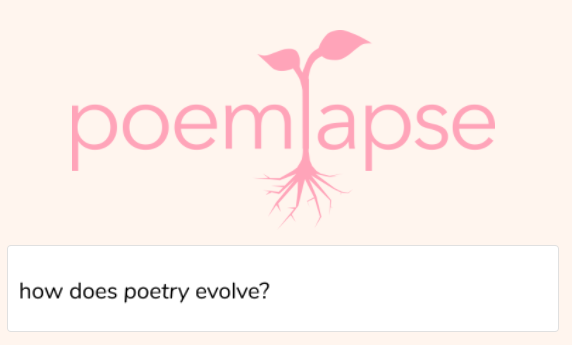
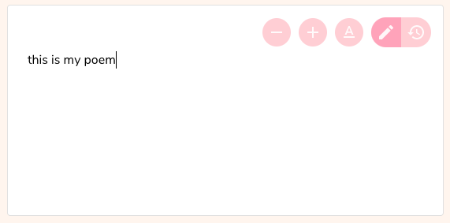
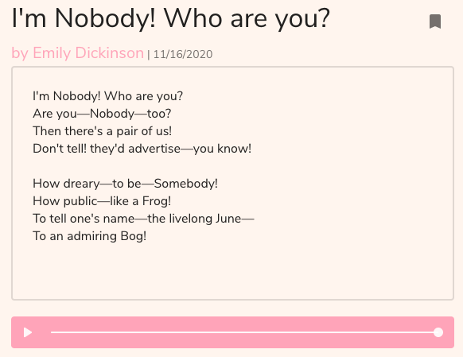
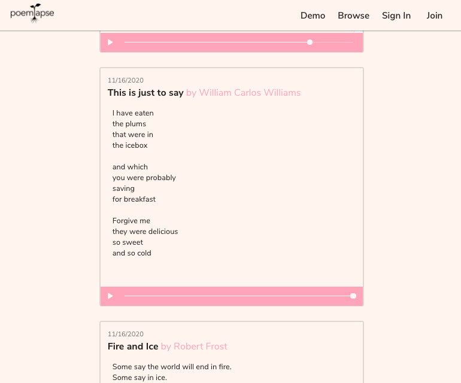
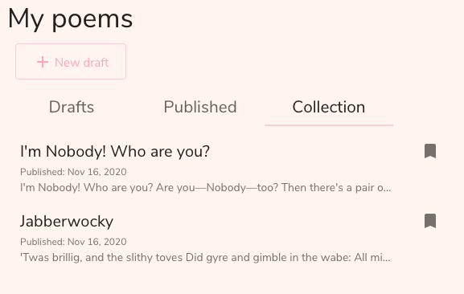
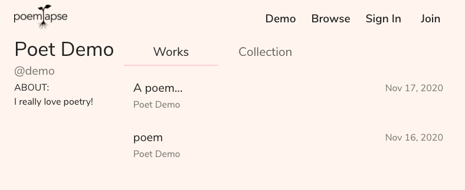

# Poemlapse

Poemlapse is a clone of the software behind [Midst](http://midst.press/), a poetry journal that allows its readers to experience a poem chronologically, from the first keystroke to the final draft.

Using Poemlapse, you can write poems and replay your process in the editor. Work on drafts, and publish them for others to view. Browse recent works and save your favorites.

## Technologies
- React / Redux
- Python / Flask
- PostgreSQL
- SQLAlchemy
- Material-UI
- Docker / Heroku

## Features

### Editor
Custom text editor allows users to easily switch between composing their poem and replaying every step of their writing process. Font/size can be changed to suit the writer's preference.

### Publish drafts
When a poem is ready, it can be published, so that others can see the finished poem and its complete history. If a user changes their mind, they can return a published work to their drafts to continue making changes.

### Browse poems
Users and guests can browse all of the works that have been published, and replay the chronological history of any poem as they scroll through.

### Save Poems
Users can save their favorite works to their collection, so that they can revisit them again and again.

### User Profiles
Each user has a profile which displays both their own published works, and the works they have saved to their collection.

## Midst
The Poemlapse app is just a demo, but if you'd like to see real poetry in process, check out [Midst](http://midst.press/). Midst is a digital journal publishing poems in the form of interactive timelapses. You can explore Midst's [issues](http://midst.press/read) and learn more at their [website](http://midst.press/about). You can also support Midst by becoming a [patron](https://www.patreon.com/midstpoetry).

This demo was created with permission from the Midst team, although it is not an official part of the project. I am grateful to their generosity in letting me play with their beautiful concept.
